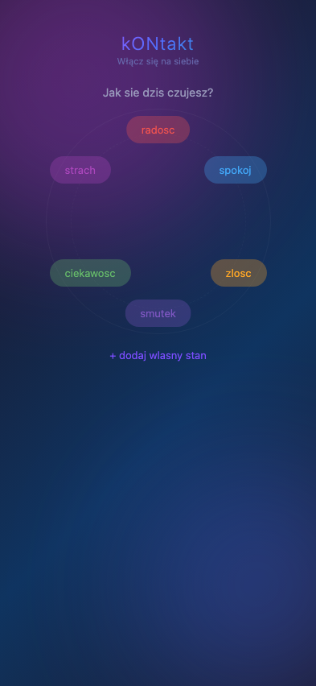
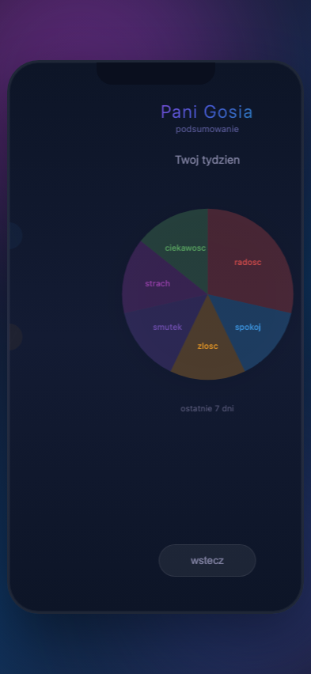
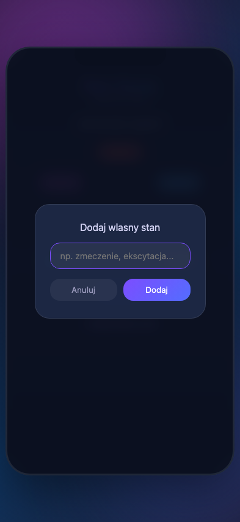

# kONtakt

**Włącz się na siebie**

Emocje, potrzeby, wewnętrzne spełnienie (dobrostan psychiczny).

## Opis

kONtakt pomaga rodzicom i dzieciom w codziennym rozpoznawaniu i nazywaniu swoich stanow emocjonalnych. Wieczorny rytual polega na wybraniu emocji z kola emocji. Aplikacja zapisuje wybory i pokazuje podsumowanie tygodnia w formie wykresu kolowego.

## Funkcje

- Kolo emocji z 6 podstawowymi stanami (radosc, spokoj, zlosc, smutek, strach, ciekawosc)
- Mozliwosc dodawania wlasnych stanow emocjonalnych
- Wykres kolowy podsumowania ostatnich 7 dni
- 2 profile: dziecko i rodzic (planowane)
- Responsywny layout — 100% szerokosci ekranu na telefonie, tablecie i desktopie
- Dane zapisywane lokalnie (brak backendu)

## Uruchomienie

Otworz `index.html` w przegladarce. Nie wymaga serwera ani build stepu.

## Screenshoty

| Ekran | Podglad |
|-------|---------|
| Kolo emocji |  |
| Wykres kolowy |  |
| Dodawanie stanu |  |

## Live

**https://rafalsladek.github.io/PaniGosia/**

Kazdy push na `main` automatycznie deployuje nowa wersje.

## Technologia (planowana)

- SvelteKit + IndexedDB
- PWA offline-first
- Brak backendu — dane lokalne

## Spec

Szczegolowy design: [docs/superpowers/specs/2026-04-04-pani-gosia-design.md](docs/superpowers/specs/2026-04-04-pani-gosia-design.md)
