# Kwiat Uczuć

**Włącz się na siebie**

Emocje, potrzeby, wewnętrzne spełnienie (dobrostan psychiczny).

## Opis

Kwiat Uczuć pomaga rodzicom i dzieciom w codziennym rozpoznawaniu i nazywaniu swoich stanów emocjonalnych. Wieczorny rytuał polega na wybraniu emocji z koła emocji opartego na Feelings Wheel (Dr. Gloria Willcox). Aplikacja oferuje 7 podstawowych emocji z możliwością dodawania własnych stanów.

## Funkcje

- Koło emocji z 7 podstawowymi stanami (radość, smutek, wstręt, złość, strach, dyskomfort, zaskoczenie)
- Animowany przełącznik koło/kwiat emocji
- Możliwość dodawania własnych stanów emocjonalnych
- 2 palety kolorów: ciemna i jasna
- Responsywny layout — telefon, tablet, desktop
- Dane zapisywane lokalnie (brak backendu)

## User Journey

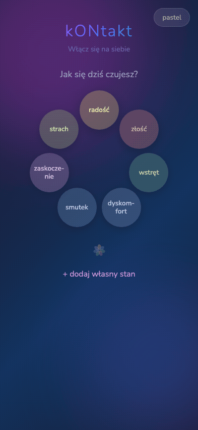

## Screenshoty

### iPhone SE

| Widok | Jasny | Ciemny |
|-------|-------|--------|
| Koło emocji | 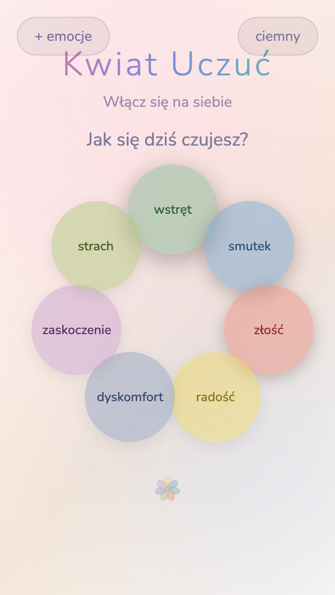 | 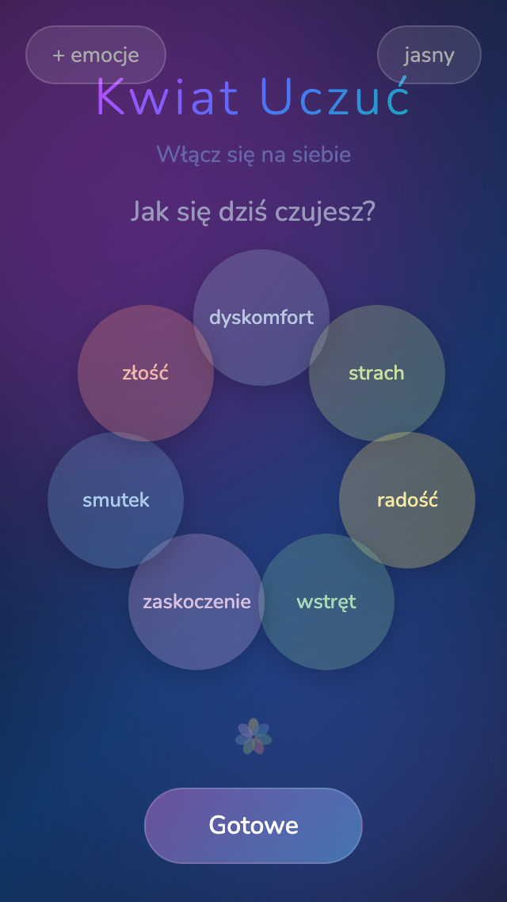 |
| Kwiat emocji | 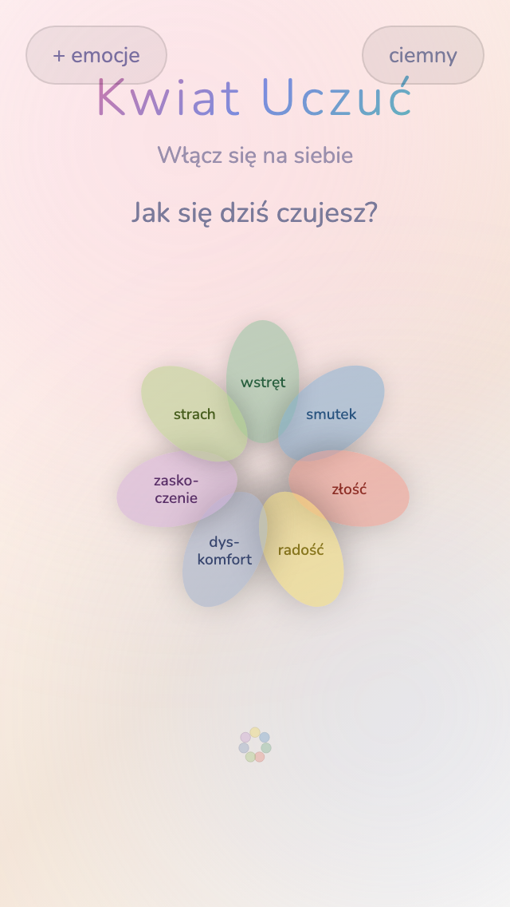 | 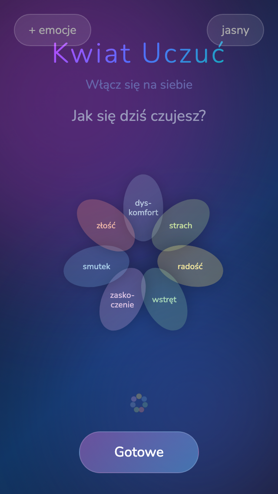 |
| Wykres | 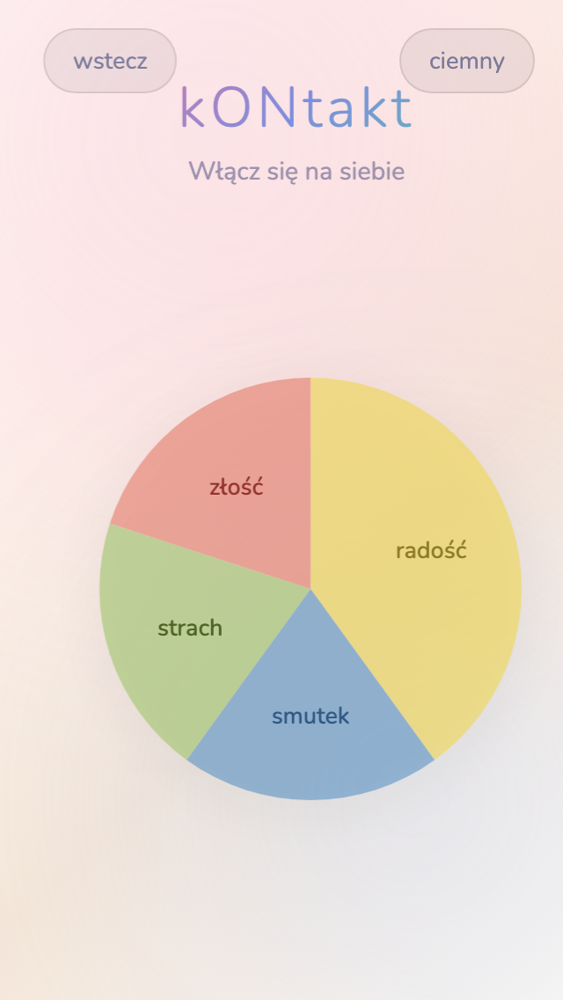 | 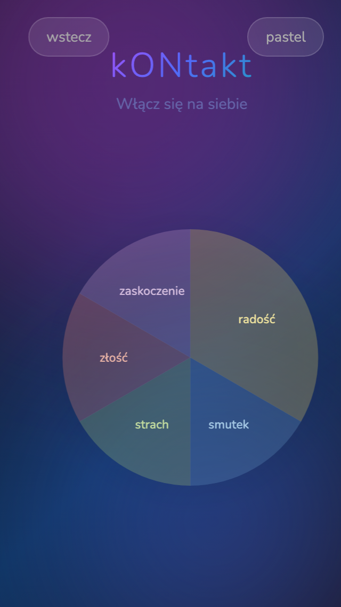 |

### Desktop

| Jasny | Ciemny |
|-------|--------|
| 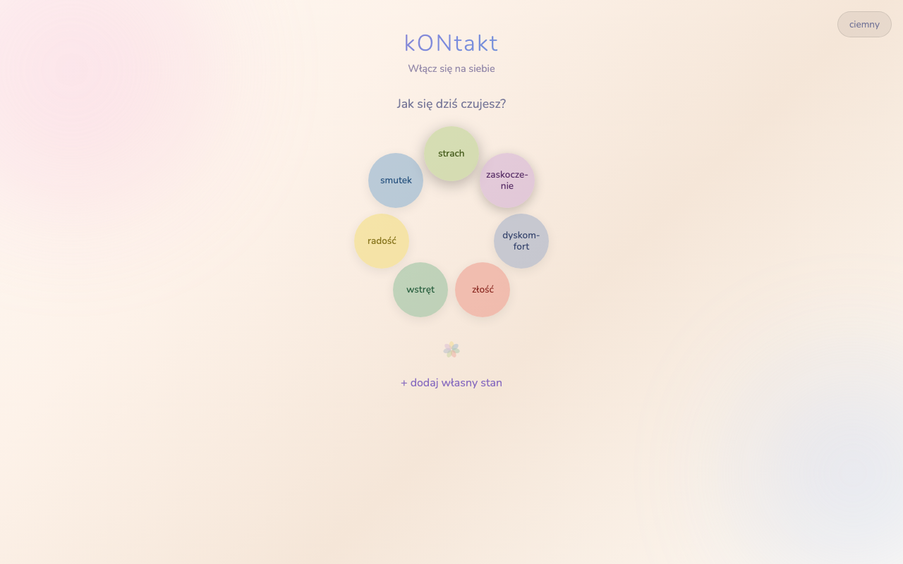 | 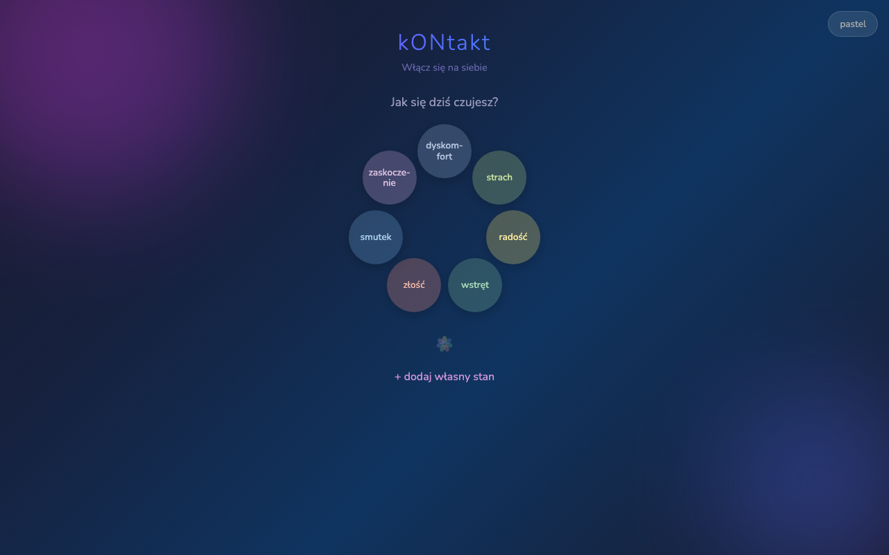 |
| 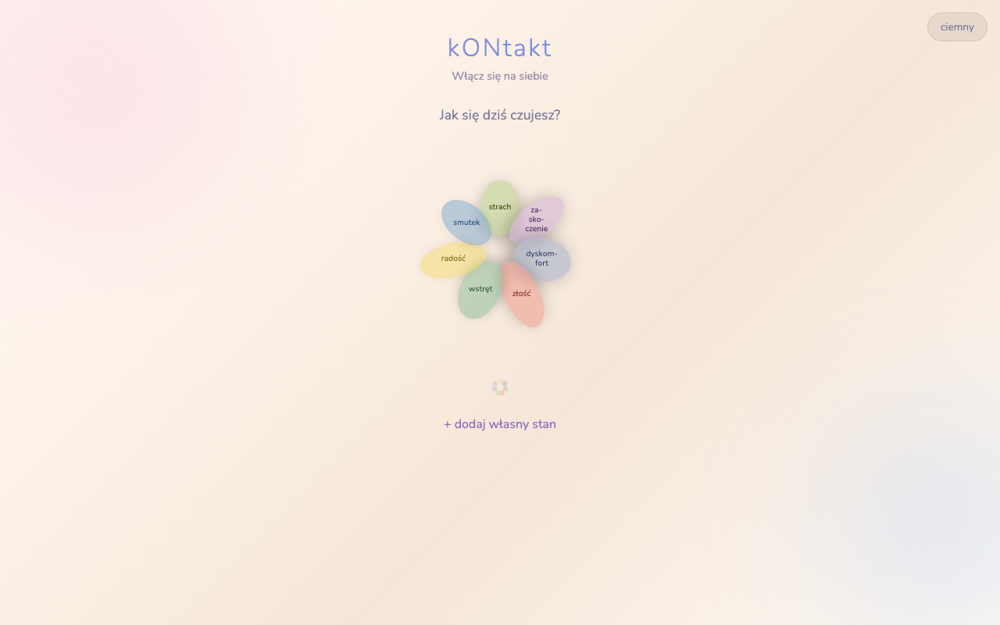 | 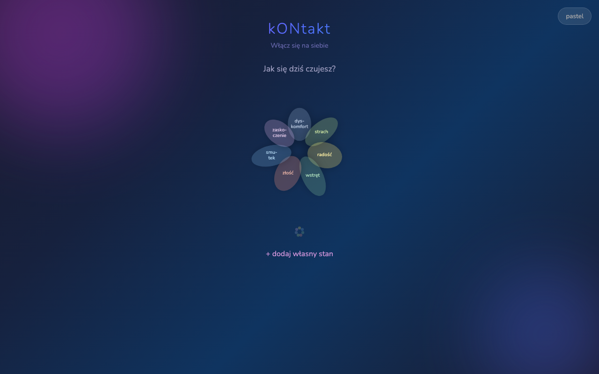 |

## Live

**https://kwiatuczuc.pl/**

Mirror: https://rafalsladek.github.io/kONtakt/

Każdy push na `main` automatycznie deployuje nową wersję via GitHub Pages.

## Technologia

- Single-file HTML/CSS/JS — brak build stepu
- PWA offline-first (service worker + manifest)
- Dane lokalne (localStorage)
- Brak backendu

## Uruchomienie

Otwórz `index.html` w przeglądarce. Nie wymaga serwera ani build stepu.

## Spec

Szczegółowy design: [docs/superpowers/specs/2026-04-04-pani-gosia-design.md](docs/superpowers/specs/2026-04-04-pani-gosia-design.md)

## Strategia

Strategia produktu i marketingu: [docs/kwiat-uczuc-strategia-v2.md](docs/kwiat-uczuc-strategia-v2.md)
