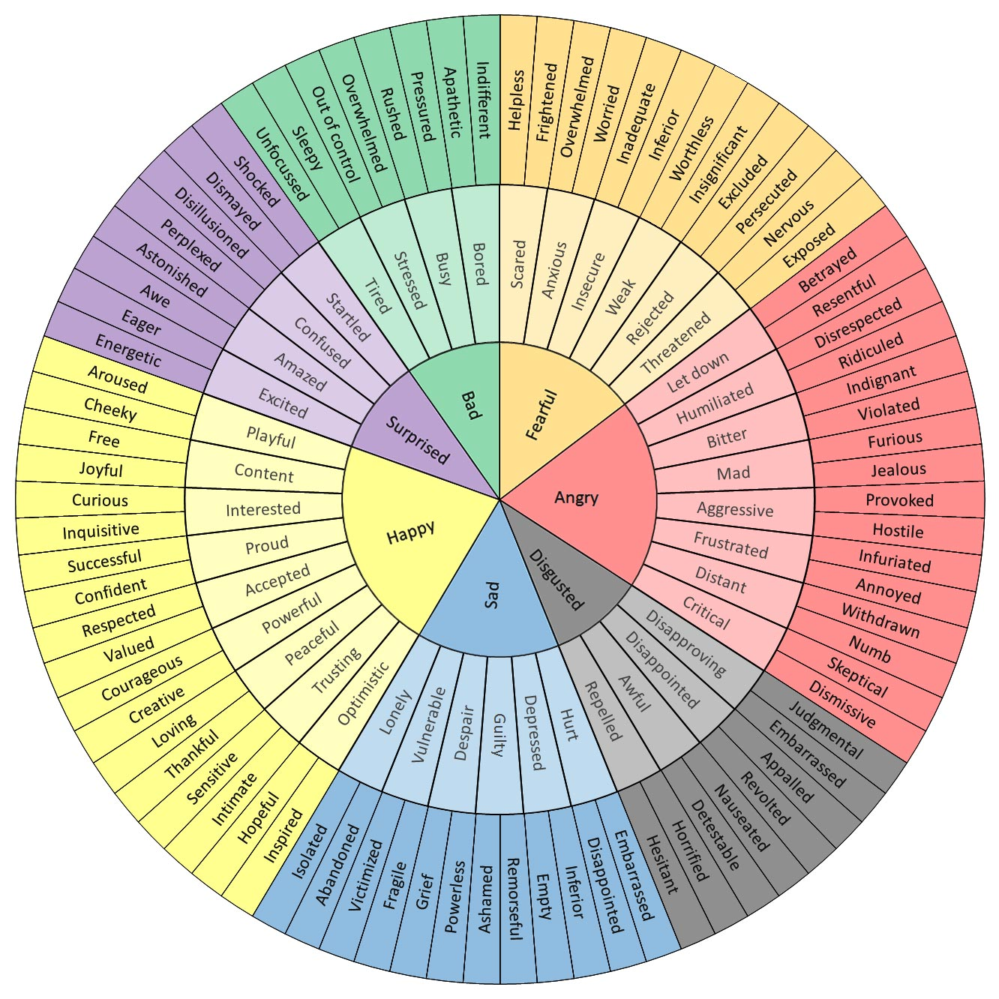

# Koło Uczuć — dokumentacja

## Źródło

**The Feelings Wheel** by Dr. Gloria Willcox

- Strona: [feelingswheel.com](https://feelingswheel.com/)
- Oryginał: [feelings-wheel-original.jpg](feelings-wheel-original.jpg)

Koło uczuć to narzędzie psychologiczne pomagające w identyfikacji i nazywaniu emocji. Składa się z trzech koncentrycznych pierścieni — od ogólnych emocji w centrum do coraz bardziej szczegółowych na zewnątrz.

---

## Struktura

### Rdzeń — 7 głównych emocji

| EN | PL |
|---|---|
| Happy | **Radość** |
| Sad | **Smutek** |
| Disgusted | **Wstręt** |
| Angry | **Złość** |
| Fearful | **Strach** |
| Bad | **Dyskomfort** |
| Surprised | **Zaskoczenie** |

---

### Pełne tłumaczenie — 3 poziomy

#### RADOŚĆ (Happy)

| Środkowy | Zewnętrzny |
|---|---|
| Figlarność (Playful) | Pobudzenie (Aroused), Żywiołowość (Cheeky) |
| Zadowolenie (Content) | Swoboda (Free), Wesołość (Joyful) |
| Zainteresowanie (Interested) | Ciekawość (Curious), Dociekliwość (Inquisitive) |
| Duma (Proud) | Pewność siebie (Confident), Poczucie sukcesu (Successful) |
| Akceptacja (Accepted) | Szacunek (Respected), Docenienie (Valued) |
| Siła (Powerful) | Odwaga (Courageous), Kreatywność (Creative) |
| Spokój (Peaceful) | Miłość (Loving), Wdzięczność (Thankful) |
| Zaufanie (Trusting) | Wrażliwość (Sensitive), Bliskość (Intimate) |
| Optymizm (Optimistic) | Nadzieja (Hopeful), Inspiracja (Inspired) |

#### SMUTEK (Sad)

| Środkowy | Zewnętrzny |
|---|---|
| Samotność (Lonely) | Izolacja (Isolated), Porzucenie (Abandoned) |
| Bezbronność (Vulnerable) | Bezsilność (Victimized), Kruchość (Fragile) |
| Rozpacz (Despair) | Żałoba (Grief), Bezradność (Powerless) |
| Poczucie winy (Guilty) | Wstyd (Ashamed), Żal (Remorseful) |
| Przygnębienie (Depressed) | Pustka (Empty), Poczucie niższości (Inferior) |
| Zranienie (Hurt) | Rozczarowanie (Disappointed), Złamane serce (Heartbroken) |

#### WSTRĘT (Disgusted)

| Środkowy | Zewnętrzny |
|---|---|
| Dezaprobata (Disapproving) | Osądzanie (Judgemental), Pogarda (Embarrassed) |
| Zawód (Disappointed) | Zniesmaczenie (Appalled), Bunt (Revolted) |
| Odraza (Awful) | Mdłości (Nauseated), Niechęć (Detestable) |
| Obrzydzenie (Repugnant) | Wstręt (Hesitant), Przerażenie (Horrified) |

#### ZŁOŚĆ (Angry)

| Środkowy | Zewnętrzny |
|---|---|
| Rozczarowanie (Let down) | Zdrada (Betrayed), Brak szacunku (Resentful) |
| Upokorzenie (Humiliated) | Poniżenie (Disrespected), Wyśmianie (Ridiculed) |
| Uraza (Bitter) | Oburzenie (Indignant), Pogwałcenie (Violated) |
| Wściekłość (Mad) | Zazdrosność (Jealous), Furia (Furious) |
| Agresja (Aggressive) | Prowokacja (Provoked), Wrogość (Hostile) |
| Frustracja (Frustrated) | Rozdrażnienie (Infuriated), Gniew (Annoyed) |
| Dystans (Distant) | Wycofanie (Withdrawn), Otępienie (Numb) |
| Krytycyzm (Critical) | Sceptycyzm (Skeptical), Lekceważenie (Dismissive) |

#### STRACH (Fearful)

| Środkowy | Zewnętrzny |
|---|---|
| Przerażenie (Scared) | Bezradność (Helpless), Trwoga (Frightened) |
| Niepokój (Anxious) | Przytłoczenie (Overwhelmed), Zmartwienie (Worried) |
| Niepewność (Insecure) | Nieadekwatność (Inadequate), Poczucie niższości (Inferior) |
| Słabość (Weak) | Bezwartościowość (Worthless), Nieistotność (Insignificant) |
| Odrzucenie (Rejected) | Wykluczenie (Excluded), Prześladowanie (Persecuted) |
| Zagrożenie (Threatened) | Nerwowość (Nervous), Odsłonięcie (Exposed) |

#### DYSKOMFORT (Bad)

| Środkowy | Zewnętrzny |
|---|---|
| Znudzenie (Bored) | Obojętność (Indifferent), Apatia (Apathetic) |
| Zabieganie (Busy) | Presja (Pressured), Pośpiech (Rushed) |
| Stres (Stressed) | Przytłoczenie (Overwhelmed), Brak kontroli (Out of control) |
| Zmęczenie (Tired) | Senność (Sleepy), Rozkojarzenie (Unfocused) |

#### ZASKOCZENIE (Surprised)

| Środkowy | Zewnętrzny |
|---|---|
| Oszołomienie (Startled) | Szok (Shocked), Osłupienie (Dismayed) |
| Zdezorientowanie (Confused) | Zagubienie (Disillusioned), Dezorientacja (Perplexed) |
| Zdumienie (Amazed) | Zachwyt (Astonished), Podziw (Awe) |
| Ekscytacja (Excited) | Podekscytowanie (Energetic), Energia (Eager) |

---

## Zastosowanie w kONtakt

Koło uczuć jest podstawą mechanizmu wyboru emocji w aplikacji kONtakt. Plan implementacji:

1. **Poziom 1 (rdzeń)** — 7 głównych bąbelków na ekranie startowym
2. **Poziom 2 (środkowy)** — po kliknięciu głównej emocji, rozwijają się bardziej szczegółowe stany
3. **Poziom 3 (zewnętrzny)** — opcjonalnie, dla użytkowników którzy chcą dokładniej nazwać swoje uczucia

Użytkownik może zakończyć wybór na dowolnym poziomie — nie musi schodzić głębiej jeśli ogólna nazwa wystarczy.

### Profil dziecko vs rodzic

- **Dziecko:** poziom 1 (7 głównych) + uproszczony poziom 2
- **Rodzic:** pełne 3 poziomy

---

## Kontekst naukowy

### The Feelings Wheel

Koło uczuć w wersji z [feelingswheel.com](https://feelingswheel.com/) jest popularnym narzędziem terapeutycznym. Strona udostępnia je jako darmowy zasób (originally shared by Geoffrey Roberts). Koło jest powszechnie używane w terapii, edukacji emocjonalnej i coachingu.

### Robert Plutchik — Wheel of Emotions (1980)

Najbardziej uznanym naukowym modelem koła emocji jest **Wheel of Emotions** Roberta Plutchika (1927–2006), amerykańskiego psychologa z Columbia University i Albert Einstein College of Medicine.

**8 emocji podstawowych** (w parach bipolarnych):
- Radość ↔ Smutek
- Zaufanie ↔ Wstręt
- Strach ↔ Złość
- Zaskoczenie ↔ Oczekiwanie

**Kluczowe cechy modelu:**
- Emocje mają różne poziomy intensywności (np. irytacja → złość → furia)
- Emocje podstawowe łączą się w emocje złożone (np. radość + zaufanie = miłość)
- Model ewolucyjny — emocje służą przetrwaniu i występują u różnych gatunków

**Publikacje źródłowe:**
- Plutchik, R. (1962). *The Emotions: Facts, Theories, and a New Model*
- Plutchik, R. (1980). *Emotion: A Psychoevolutionary Synthesis*
- Plutchik, R. (2003). *Emotions and Life: Perspectives from Psychology, Biology, and Evolution*

### Paul Ekman — Basic Emotions (1992)

Paul Ekman w badaniach międzykulturowych zidentyfikował **6 podstawowych emocji** uniwersalnych dla wszystkich kultur:
- Złość, Wstręt, Strach, Radość, Smutek, Zaskoczenie

W latach 90. rozszerzył listę o: rozbawienie, pogardę, zadowolenie, zakłopotanie, ekscytację, poczucie winy, dumę, ulgę, satysfakcję i wstyd.

**Publikacja źródłowa:**
- Ekman, P. (1992). *An Argument for Basic Emotions.* Cognition & Emotion, 6(3-4), 169-200.

### James Russell — Circumplex Model (1980)

Model kołowy Russella organizuje emocje na dwóch osiach:
- **Walencja** (przyjemne ↔ nieprzyjemne)
- **Pobudzenie** (wysokie ↔ niskie)

**Publikacja źródłowa:**
- Russell, J.A. (1980). *A circumplex model of affect.* Journal of Personality and Social Psychology, 39(6), 1161-1178.

---

## Związek z kONtakt

Aplikacja kONtakt łączy praktyczne podejście Feelings Wheel (3 poziomy szczegółowości, przystępny język) z naukowym fundamentem Plutchika (ewolucyjne znaczenie emocji, bipolarne pary, intensywność).

Uproszczony model dla dzieci opiera się na 6 emocjach Ekmana — uniwersalnych i łatwych do rozpoznania nawet przez małe dzieci.

---

## Źródła i licencje

- Feelings Wheel: [feelingswheel.com](https://feelingswheel.com/) — darmowy zasób, originally shared by Geoffrey Roberts
- Plutchik's Wheel: Robert Plutchik, *Emotion: A Psychoevolutionary Synthesis* (1980)
- Ekman's Basic Emotions: Paul Ekman, *An Argument for Basic Emotions* (1992)
- Circumplex Model: James A. Russell, *A circumplex model of affect* (1980)
